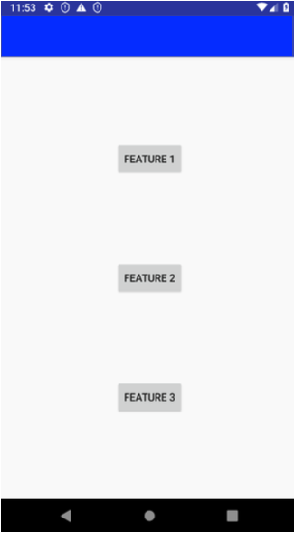

# Page object

How to make tests more clear and readable?

## Problem:

There is a lot of `ViewMatchers` and so on in our tests once we need to find exact `View`.
<br/>
Imagine that we do have hundreds of tests that starts with pressing same button. What will be if that button would
change its id? We would change `ViewMatcher` inside every single test.
<br/>
Also there is a problem if our `View` should be accessed with a lot of `ViewMatchers` used (for example when that `View`
is a child of `RecyclerView`)
<br/>

What should we do in the above cases? May we should extract this `View` to another abstraction?

### PageObject pattern

Actually that pattern came to Android world from Web testing. This is how `PageObject` determined by one of its creator:
> The basic rule of thumb for a page object is that it should allow a software client to do anything and see anything that a human can. It should also provide an interface that's easy to program to and hides the underlying widgetry in the window. So to access a text field you should have accessor methods that take and return a string, check boxes should use booleans, and buttons should be represented by action oriented method names.
> <br/> www.martinfowler.com/bliki/PageObject.html

### Example

We do have some screen with 3 `Buttons`



#### Let's write some test for that screen with plain espresso

```kotlin
@Test
fun testFirstFeature() {
    onView(withId(R.id.toFirstFeature))
        .check(ViewAssertions.matches(
                ViewMatchers.withEffectiveVisibility(
                ViewMatchers.Visibility.VISIBLE)))
    onView(withId(R.id.toFirstFeature)).perform(click())
}
```

That test finds one of our button then checks its visibility and after that performs usual click.

Main problem here — it's not easy to read.

#### What do we want to achieve with PageObject?

Ideally we want to have something like

```kotlin
@Test
fun testFirstFeature() {
    MainScreen.firstFeatureButton.isVisible()
    MainScreen.firstFeatureButton.click()
}
```

What is the difference we can see here?

* We use `ViewMatcher` inside of our test <br/>
* We added `MainScreen` abstraction that actually is a `PageObject` of screen provided in example <br/>
* `isVisible()` and `click()` are extensions (for example)

As you can see that change made our code more clear and readable. And that happened even with one single test that
checks visibility of button and clicks on it.

Just imagine how much effort that pattern will bring to your codebase in case of hundreds tests written
with `PageObject`

### Instead of writing your own implementation of PageObject pattern

Just take a look for [Kakao library](https://github.com/agoda-com/Kakao) it has a modern `Kotlin DSL` implementation
of `PageObject` pattern

A lot of useful classes for interact with. <br/>
For example, same test for our screen written with `Kakao` library will look like

```kotlin
@Test
fun testFirstFeature() {
    mainScreen {
        toFirstFeatureButton {
            isVisible()
            click()
        }
    }
}
```

## Conclusion

`PageObject` pattern helps us to:

➕ Remove duplicates of `ViewMatchers` from tests <br/>
➕ Once we change id/text/whatever of `View` we should change it only in one place of `PageObject` class <br/>
➕ New abstraction to make code more readable and clear